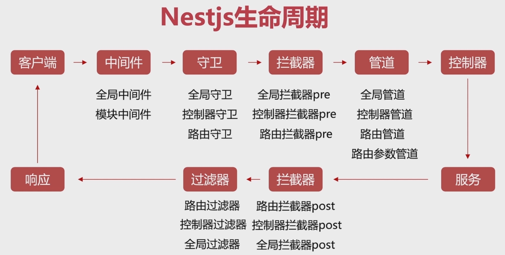

# NestJS

## 初始化

```
安装脚手架：
$ npm i -g @nestjs/cli

创建项目：
$ nest new project-name

运行：
pnpm start
pnpm start:dev
```

## 单个模块文件架构

```
xxx 模块
├── xxx.controller.ts // 控制器。处理请求和响应
├── xxx.controller.spec.ts // 针对控制器的单元测试
├── xxx.service.ts // 服务。接口业务逻辑代码
├── xxx.entity.ts // 实体。与数据库表或集合对应的对象模型，用于表示数据的结构和关系
├── xxx.module.ts // 根模块。将本模块内相关代码组合在一起
```

## 常用命令

```
// 创建完整功能模块：
// 1. 生成module
nest g mo [name]
// 2. 生成controller
nest g co [name]
// 3. 生成service
nest g s [name]

// 创建基础CRUD模块：
nest g res user
```

## 热重载

配置步骤：

1. 安装包

   ```
   pnpm i --save-dev webpack-node-externals run-script-webpack-plugin webpack
   pnpm i -D @types/webpack-env
   ```

2. 根目录创建`webpack-hmr.config.js`文件

   ```js
   const nodeExternals = require('webpack-node-externals')
   const { RunScriptWebpackPlugin } = require('run-script-webpack-plugin')
   
   module.exports = function (options, webpack) {
     return {
       ...options,
       entry: ['webpack/hot/poll?100', options.entry],
       externals: [
         nodeExternals({
           allowlist: ['webpack/hot/poll?100']
         })
       ],
       plugins: [
         ...options.plugins,
         new webpack.HotModuleReplacementPlugin(),
         new webpack.WatchIgnorePlugin({
           paths: [/\.js$/, /\.d\.ts$/]
         }),
         new RunScriptWebpackPlugin({
           name: options.output.filename,
           autoRestart: false
         })
       ]
     }
   }
   
   ```

3. `main.ts`中增加 webpack 相关配置

   ```ts
   async function bootstrap() {
     const app = await NestFactory.create(AppModule)
   
     // 设置接口前缀
     app.setGlobalPrefix('api/v1')
   
     await app.listen(3000)
     console.log('启动成功，点击 http://localhost:3000/api/v1 访问')
   
     if (module.hot) {
       module.hot.accept()
       module.hot.dispose(() => app.close())
     }
   }
   ```

4. 配置启动命令

   ```
   "start:dev": "nest build --webpack --webpackPath webpack-hmr.config.js --watch"
   ```

## 生命周期



## 模块

### 定义

模块是带有`@Module()`装饰器的类。`@Module()`装饰器提供元数据，Nest 使用这些元数据来组织应用程序的结构。每个应用程序至少有一个根模块

### @Module()

`@Module()`具有如下 4 个属性：

1. providers：用于声明当前模块的服务提供者
2. controllers：用于声明当前模块的控制器
3. imports：用于声明当前模块依赖的其他模块
4. exports：用于声明当前模块向外部暴露的提供者

## 配置环境变量

为了方便本地和生产环境的开发过程中连接不同的数据库，最佳做法是将配置变量存储在环境中。以下是使用`@nestjs/config`来实现配置：

1. 安装依赖

   ```
   pnpm i @nestjs/config dotenv -S
   pnpm i cross-env -D
   ```

2. 创建环境变量相关文件

   * `.env`文件，存放公共环境变量
   * `.env.development`文件，存放开发环境变量
   * `.env.production`文件，存放生成环境变量

3. 修改启动命令，用于区分开发环境和生产环境

   ```
   "start:dev": "cross-env NODE_ENV=development nest build --webpack --webpackPath webpack-hmr.config.js --watch",
   "start:prod": "cross-env NODE_ENV=production node dist/main",
   ```

4. 根 `AppModule` 中导入 ConfigModule

   ```js
   const envFilePath = `.env.${process.env.NODE_ENV || 'development'}`
   
   @Module({
     imports: [
       // 实现了将.env 文件中的配置与 process.env 相对应，通过 ConfigService 可读取配置
       ConfigModule.forRoot({
         // 表示在全局都可以使用 ConfigService
         isGlobal: true,
         // 指定加载的环境变量文件路径
         envFilePath,
         // 将.env 文件的配置信息与其他环境变量文件共享
         load: [() => dotenv.config({ path: '.env' })]
       }),
       UserModule
     ],
     controllers: [AppController],
     providers: [AppService]
   })
   ```

5. 在子模块内测试配置读取（以 user.controller.ts 为例）

   ```js
   import { ConfigService } from '@nestjs/config'
   
   @Controller('user')
   export class UserController {
     constructor(
       private userService: UserService,
       private configService: ConfigService
     ) {}
   
     @Get()
     getUser(@Query('id') id: string): any {
       const db = this.configService.get('DB')
       console.log('db', db) // 与启动命令相关
       const dbUrl = this.configService.get('DB_URL')
       console.log('dbUrl', dbUrl) // www.taoloading.com
       return this.userService.getUser(id)
     }
   }
   ```

6. 补充 1：在如`const db = this.configService.get('DB')`的语句中，使用枚举变量代替字符串，便于后期修改

   1. 创建枚举属性文件（enum/config.enum.ts）并定义属性

      ```js
      export enum ConfigEnum {
        DB = 'DB',
        DB_HOST = 'DB_HOST'
      }
      ```

   2. 使用

      ```ts
      const db = this.configService.get(ConfigEnum.DB)
      ```

7. 补充 2：还可使用`config`包实现省略步骤 3 中指定环境变量文件路径和 .env 共享的操作，通过配置相关文件夹，`config`包判断环境自动读取对应的环境变量文件，并自动携带 .env 文件内容

## 配置 docker 并操作数据库

### 配置 docker

1. 安装 docker 程序和 mysql、adminer 镜像

2. 配置`docker-compose.yml`文件

   ```yaml
   version: '3.1'
   
   services:
     db:
       image: mysql
       command: --default-authentication-plugin=mysql_native_password
       restart: always
       environment:
         MYSQL_ROOT_PASSWORD: example
       ports:
         # 此处使用了 3307 端口，避免和本机 MySQL 冲突
         - 3307:3306
   ```

3. 执行`docker-compose up -d`运行 docker

### 使用 TypeORM 连接数据库

1. 安装`TypeORM `相关包

   ```
   pnpm i @nestjs/typeorm typeorm mysql2 -S
   ```

2. `app.module.ts`中配置`TypeORM `

   ```js
   @Module({
     imports: [
       TypeOrmModule.forRoot({
         type: 'mysql',
         host: 'localhost',
         port: 3307,
         username: 'root',
         password: 'example',
         database: 'testDB',
         entities: [],
         synchronize: true
       })
     ],
     controllers: [AppController],
     providers: [AppService]
   })
   ```


3. 上述写法可以实现连接数据库，但无法做到不同环境时配置不同的数据库信息，使用`TypeOrmModule.forRootAsync({...})`修改配置，并使用配置的`config.enum.ts`完善代码

   ```js
   TypeOrmModule.forRootAsync({
     imports: [ConfigModule],
     inject: [ConfigService],
     useFactory: (configService: ConfigService) => ({
       type: configService.get(ConfigEnum.DB_TYPE),
       host: configService.get(ConfigEnum.DB_HOST),
       port: configService.get(ConfigEnum.DB_PORT),
       username: configService.get(ConfigEnum.DB_USERNAME),
       password: configService.get(ConfigEnum.DB_PASSWORD),
       database: configService.get(ConfigEnum.DB_DATABASE),
       entities: [],
       synchronize: configService.get(ConfigEnum.DB_SYNC)
     } as TypeOrmModuleAsyncOptions)
   })
   ```


### 创建实体

以`user.entity.ts`为例：

1. 创建 User 实体

```ts
import { Column, Entity, PrimaryGeneratedColumn } from 'typeorm'

@Entity()
export class User {
  @PrimaryGeneratedColumn()
  id: number

  @Column()
  username: string

  @Column()
  password: string
}
```

2. 在`app.module.ts`中完善 TypeOrm 配置，引入创建的 User 实体

```ts
TypeOrmModule.forRootAsync({
  imports: [ConfigModule],
  inject: [ConfigService],
  useFactory: (configService: ConfigService) =>
    ({
      type: configService.get(ConfigEnum.DB_TYPE),
      host: configService.get(ConfigEnum.DB_HOST),
      port: configService.get(ConfigEnum.DB_PORT),
      username: configService.get(ConfigEnum.DB_USERNAME),
      password: configService.get(ConfigEnum.DB_PASSWORD),
      database: configService.get(ConfigEnum.DB_DATABASE),
      // 引入创建的实体
      entities: [User],
      synchronize: configService.get(ConfigEnum.DB_SYNC)
    }) as TypeOrmModuleAsyncOptions
})
```

3. 运行程序后，数据库中自动创建对应表

### 处理表格关系（使用 TypeORM 实现：1 对 1，1 对多，多对 1）

* 1 对 1。以`profile.entity.ts`为例

  ```ts
  @Entity()
  export class Profile {
    @PrimaryGeneratedColumn()
    id: number
  
    @Column()
    gender: string
  
    @Column()
    photo: string
  
    @Column()
    address: string
  
    @OneToOne(() => User)
    @JoinColumn() // 指定关联关系中的外键列
    user: User
  }
  ```

* 1 对多。以`user.entity.ts`为例

  ```ts
  @Entity()
  export class User {
    @PrimaryGeneratedColumn()
    id: number
  
    @Column()
    username: string
  
    @Column()
    password: string
  
    @OneToMany(() => Logs, (logs) => logs.user)
    logs: Logs[]
  }
  ```

* 多对 1。以`logs.entity.ts`为例

  ```ts
  @Entity()
  export class Logs {
    @PrimaryGeneratedColumn()
    id: number
  
    @Column()
    path: string
  
    @Column()
    mathod: string
  
    @Column()
    data: string
  
    @Column()
    result: string
  
    @ManyToOne(() => User, (user) => user.logs)
    user: User
  }
  ```

